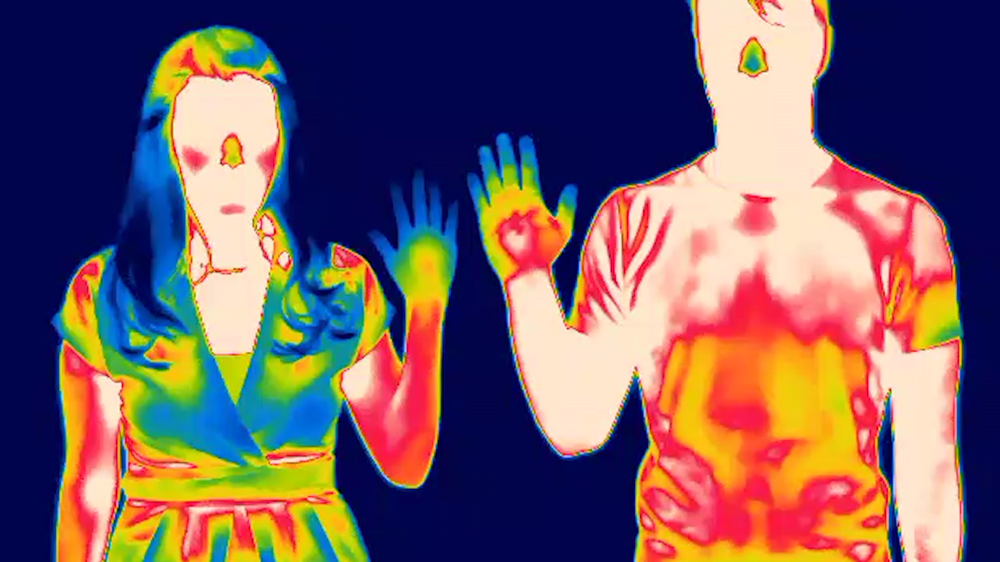
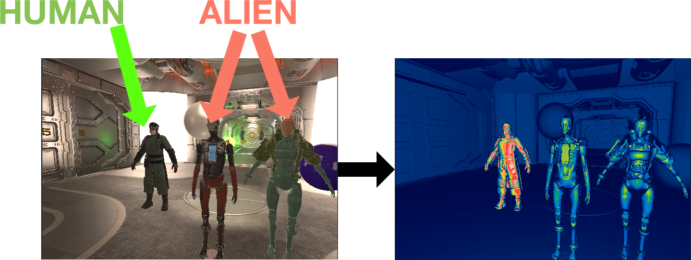
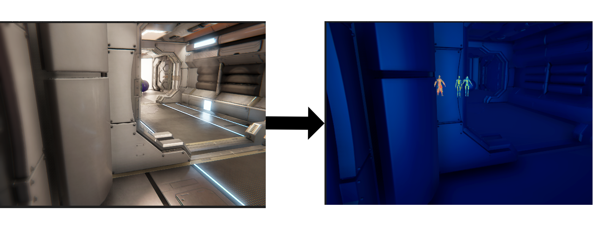
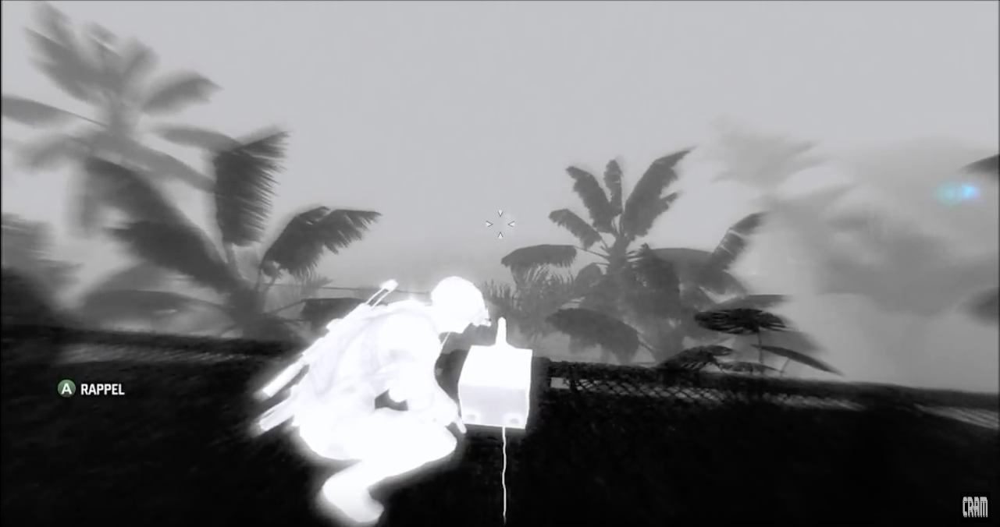
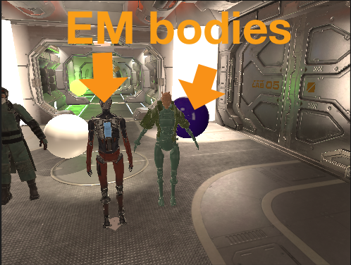
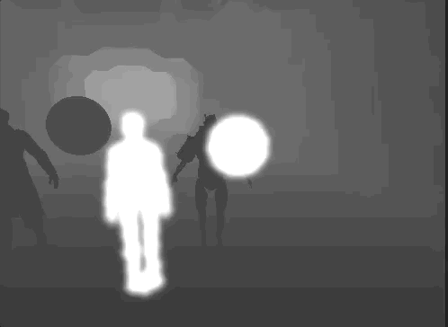
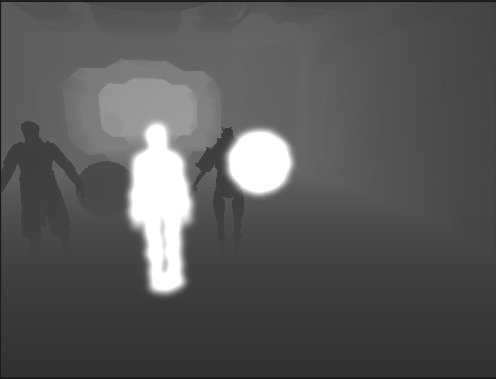

# Vision modes

Note : All of the scripts/shader/etc developed by me can be found under the `Assets/Miguel Ferreira` folder

## Night Vision

I started the implementation of the night vision mode by using a post-processing effect that would calculate the luminance for each pixel, and remove the red and blue components.

This solution worked fine but it didn't give good results for very dark places, where the luminance was 0 or close to 0. In order to make up for this lack of color information from the final image, I've used the diffuse texture from the g-buffer (__CameraGBufferTexture0_). The _Strength_ param controls the effect of the g-buffer color in the final color value.

### Problems and possible improvements
While simple and effective, this current solution shows some signs of color banding for very dark places, where dealing with very small luminance values. This would improve If I applied some kind of dithering.

Also, there is no way to control the night vision strength for a particular object in the world. This could be implemented by creating an "extra luminance" intermediate texture where we could draw a given set of elements. This texture could then be used to add more luminance to the formula.


## Thermal Vision

To get the thermal vision effect, I used some images from the web as inspiration, such as this one:



I considered the temperature going from cold to hot as a normalized value going from 0 to 1. That value would then be used to get the temperature color from the following `LUT`:


To actually get the temperature of a body, I end up using the dot product between the surface normal and the view direction. This dot product would then be used as the normalized temperature.

To allow the customization of different temperature properties per object, I've implemented a `ThermalBody` class with the following properties:


The Thermal Body affects all children renderers.

An example of the thermal effect in action is shown here



If a body is considered hot, it is rendered in another pass, on top of everything else. This allows the player to see hot bodies through walls:



### Improvements

There are some things we could improve here. First, adding a blur and/or a glow to the temperature values would give it a more "realistic" look. Also, it would be better to have a proper thermal texture map that could be applied to humans, instead of having to rely on the surface normal alone.

Another point of interest is the lights. At the moment, the lights are not being considered as an heat-emitting source automatically (though you can still add a `ThermalBody`component to them). This could be achieved by reading the emission values from the uniform values

```
sampler2D _EmissionMap;
half4 _EmissionColor;
```

in the thermal vision replacement shader.

## EM Vision

For the EM effect I used the following screenshot from Splinter Cell Blacklist as the main source of inspiration:



By inspecting we can figure out some of its parts:

+ The objects that don't emit EM waves, are rendered with a depth shader (going from black to a kind of gray as the depth increases)
+ The objects that emit EM waves have a very strong white color that is slighty affected by the view dir normal
+ A slight blur is in place
+ A grain effect is used

### Implementation

I've added a `ElectroMagneticBody` that can be added to the objects that transmits _EM_ waves. 

The rendering is achieved through a `CommandBuffer` that renders all _EM_ bodies to a separate texture, blurs it and composites that texture on top of the non-EM bodies (that are rendered with a simple depth shader).

During the composite step, a "wavy" effect is added to simulate the magnetic radition:




Gifs exhibit heavy color banding. Here is a static image of the effect:



I've also added the following configuration settings to customize the radiation effect:


### Problems and improvements

Once again, there is come color banding going on, but this could be fixed with a grain post-process effect. I'd like to add a bit of normal-based _EM_ strength variation to make the magnetic bodies look less flat.